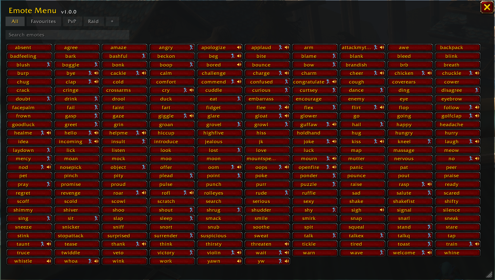

## Emote Menu

<!-- UPGRADE NOTICE: remove this once most people have moved to 1.0.0 or later.
     Everyone updating from 0.1.0 has the old folder still sitting there. -->

> ### ⚠️ Updating from an older version? Delete the old folder.
>
> The addon folder is now **`EmoteMenu`**. It used to be
> **`wowEmoteMenu-main`**, and WoW will not remove the old one for you.
>
> Delete `Interface/AddOns/wowEmoteMenu-main` after updating. Leaving it means
> two copies of the addon installed, both answering `/emotemenu` and both
> putting an icon on your minimap.
>
> Your panel position and minimap icon position reset once as part of this. That
> is the whole cost, and it only happens this once.

### This simple addon creates a menu that lists all possible emotes in the game. A tooltip tells you what the emote text will be and a simple click will perform that emote.

### You can access the emote menu by clicking the minimap icon or by typing `/emotemenu` (short form: `/emm`)

### Have fun seeing and using all the emotes so rarely utilized!

### Using it

**Search** narrows the list as you type. It matches the emote's name, its slash
command, and the text the server prints -- so "sorry" finds `apologize` and
"cheers" finds `drink`.

**The little icons** on a button mean the emote plays a sound (the speaker) or
an animation (the dancer). Every emote was checked in game one at a time.

**Drag the bottom-right corner** to resize. The columns reflow to fit and a
scrollbar appears only when it is needed.

**The cog** at the top right opens the options: whether the list runs A to Z
across the rows or down the columns, how wide and how tall the buttons are,
whether Escape closes the menu, and whether the minimap icon is shown. There is
a **Reset to defaults** there too, which puts the size, position and appearance
back the way they shipped without touching your tabs.

### Tabs

**All** lists every emote. **Favourites** starts empty and is yours to fill.

**PvP** and **Raid** come with a starting set of emotes. Press **+** to make
your own tab, and any tab but All can be deleted -- the default ones can be
brought back by right-clicking **+**.

Press **Edit** on a tab to curate it: every emote appears, and clicking one
adds or removes it rather than performing it, so a stray click cannot fire an
emote at whoever you have targeted. Press **Done** when finished. You can also
right-click any emote at any time for *Add to Favourites*.

While editing, tick **Open this tab by default** to choose where the panel
starts each time you log in. During a session it reopens on whichever tab you
used last.

Search works inside the selected tab.

### A note on other game versions

The emote text was captured from a live WoW: Forever client by performing every
emote and recording what the server replied. Other versions may word a few
differently; where they do the tooltip is slightly off but the emote itself
still works. Emotes your client does not have are hidden rather than shown as
buttons that do nothing.

### Known issues

**WoW: Forever beta (1.60.1, build 69913):** the client writes addon
SavedVariables correctly but never reads them back, so settings reset on every
login. This affects every addon, not just this one, and there is nothing an
addon can do about it. Tracked at
<https://us.forums.blizzard.com/en/wow/t/savedvariables-never-load-in-the-beta-%E2%80%94-all-addon-settings-reset-on-login-69913/2354798>.

### TODO

1. Filters for animated / voiced emotes
2. Rename a tab after creating it
3. Check `/mountspecial` once a mount is available -- it needs one to do
   anything, so it is currently marked as having no animation

### Building the emote data

The emote list is generated rather than hand-written, because the wording and
the available emotes differ between game versions. `tools/` holds the addon that
records what the server actually prints and the scripts that turn that into
`wowEmoteMenuStore.lua`; `tools/README.md` explains the whole loop.

`tests/` runs the addon in a real Lua interpreter against a stubbed WoW API, so
changes can be checked without loading the game:

    python -m pip install lupa
    python tests/run_tests.py
